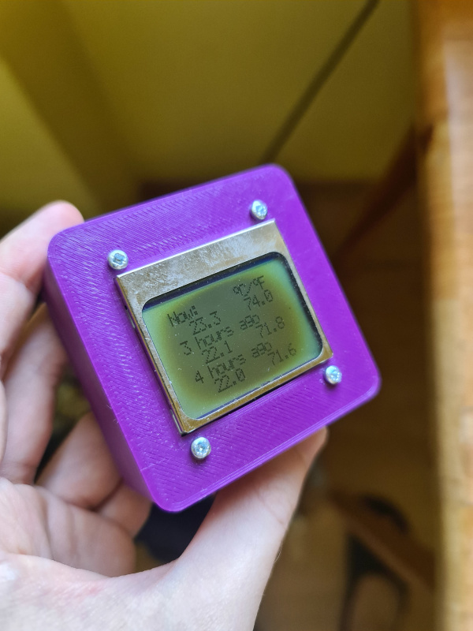
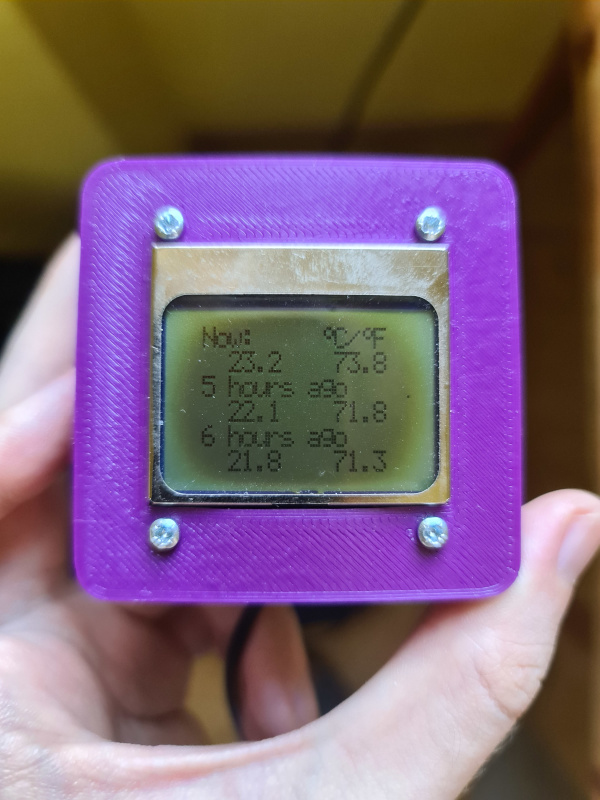
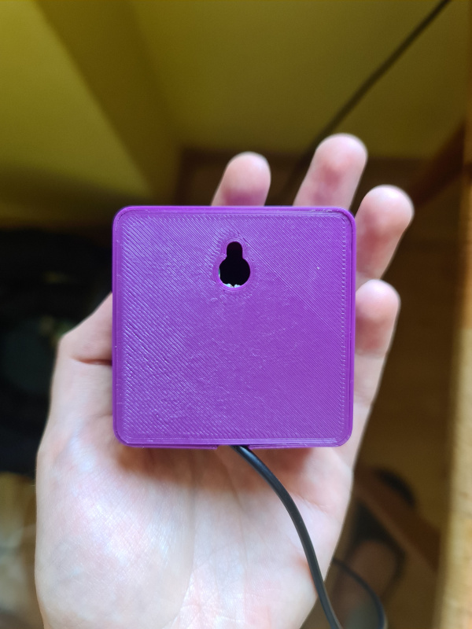
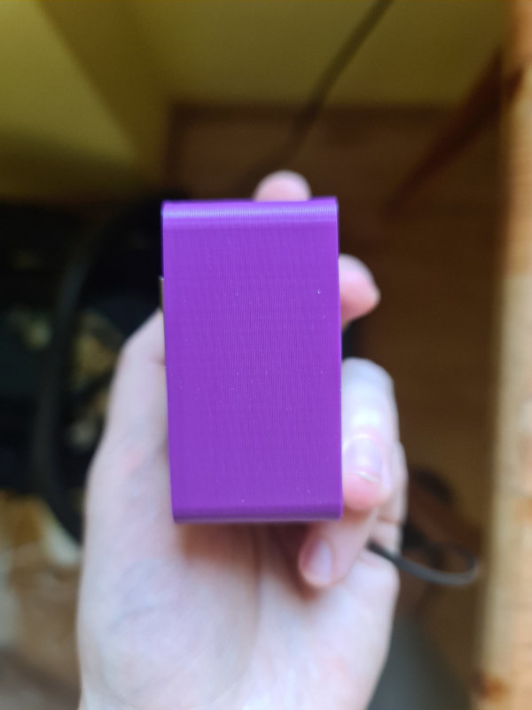

# a simple thermometer with memory

### why?
I needed a device for measuring room temperature during nights to be sure my baby is warm enough all the time. Of course it would be better to have a full-fledged temperature data logger with fancy graphs and other stuff, but I wanted to do it fast and in a cost-efficient manner.

### characteristics
* stores temperature with 12-bit resolution,
* displays temperature in °C and °F,
* holds temperature measured in the past up to 12 hours,
* no buttons needed to operate.

### components
* a Nokia 5110 display with a PCD8544 controller,
* a PIC16F628A microcontroller clocked at 4 MHz,
* a DS18B20 digital temperature sensor,
* a 3D printed PLA case,
* an old 5V power supply.

### future?
I do not plan to develop the project as it suffices my needs. Even if I decided to do so, it would be problematic with current hardware - the currently used program uses over 95% of program memory. It would be better to design a new device from scratch with a more capable microcontroller.
